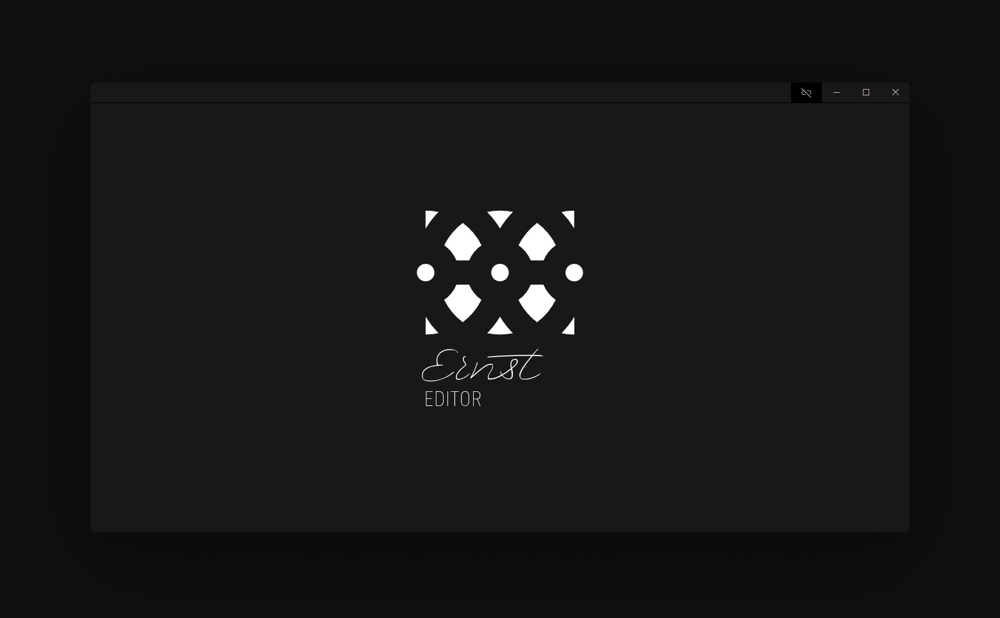
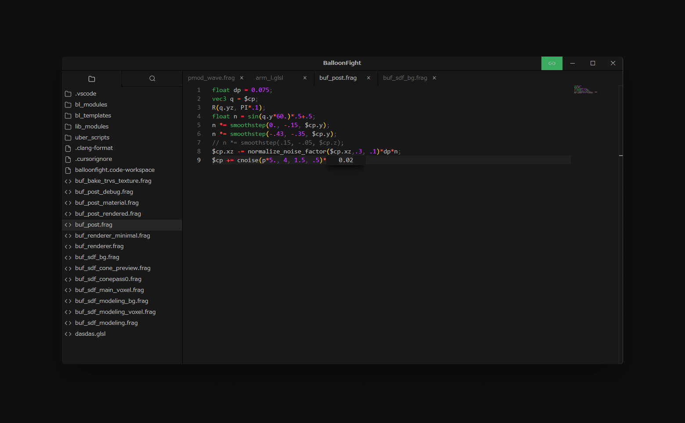
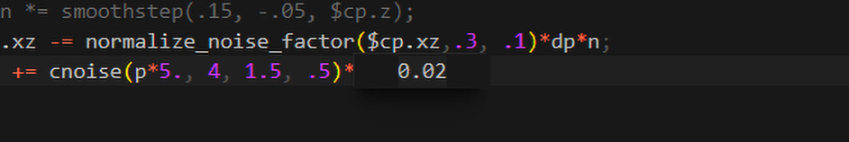

<p align="center">
  
  
</p>

# Ernst Editor

A minimal GLSL editor tailored for [ErnstRenderer](https://github.com/iY0Yi/ErnstRenderer). Adjust numeric constants inline and see immediate results—no recompilation required, even with heavy shaders.

## Overview
- Built on Monaco Editor
- Blender integration (WebSocket server auto-starts on port 8765)
- Inline numeric editing (Inline Nudgebox)
- Project tree, tabs, session persistence (open files, editor state, sidebar width)

Note: The old InlineFloat implementation is deprecated. Use InlineNudgebox.

## Usage
1. Launch Ernst Editor
2. Open a folder from the left sidebar, or open a file
3. Place the caret on a numeric literal in GLSL and press `Alt+X` to launch the Nudgebox
4. Adjust with Arrow Up/Down (changes are sent to Blender in real time)

## Nudgebox controls



An inline numeric editor that opens at the caret on numeric literals. Press Alt+X to toggle, use Arrow Up/Down to nudge the value. Changes are sent to ErnstRenderer in real time.

| Action   | Shortcut              |
|----------|-----------------------|
| Launch   | Alt+X                 |
| Confirm  | Alt+X                 |

| Modifier | Step (Arrow Up/Down) |
|----------|-----------------------|
| None     | 0.1                   |
| Alt      | 0.01                  |
| Ctrl     | 0.001                 |
| Shift    | 0.0001                |


## Development
### Setup
```bash
git clone https://github.com/yourusername/ErnstEditor.git
cd ErnstEditor
npm install
```

### Scripts
- `npm run dev-electron` Start development with hot reload
- `npm run build` Bundle only
- `npm run build-exe` Build a Windows executable

Output: `build/ErnstEditor-win32-x64/ErnstEditor.exe`

## Blender integration
- Target: Requires the custom renderer addon “ErnstRenderer”
  - Repository: [ErnstRenderer](https://github.com/iY0Yi/ErnstRenderer)
  - It will not connect on vanilla Blender without the addon
- The WebSocket server auto-starts on port 8765
- Value updates are sent in real time
- Follow the addon’s README for installation and usage (install, enable in Blender, edit GLSL in the `track` folder for hot reload)

## Command line
```bash
ErnstEditor.exe "path/to/shader.glsl"
```

## Session persistence
- Includes: open tabs, active tab, editor font size, sidebar width, window position/size
- Mechanism: persisted via `SESSION_SAVE` / `SESSION_LOAD` IPC and a session file

## Key components
- `src/renderer/App.tsx`: App root; orchestrates sidebar/tabs/editor
- `src/components/EditorContainer.tsx`: Monaco initialization and integration; automatic layout, minimap config, `editor.layout()` on resize
- `src/components/SidebarPanel.tsx`: File tree / search panel
- `src/components/TabManager.tsx`: Tab UI
- `src/components/gui/InlineNudgebox/*`: Inline numeric editing implementation
- `src/hooks/useBufferManager.ts`: Central tab/save/path update logic
- `src/hooks/useSessionManager.ts`: Session save/restore (includes `editorFontSize` / `sidebarWidth`)
- `src/services/electronClient.ts`: Typed wrapper around `window.electronAPI`
- `src/constants/ipc.ts`: IPC channel definitions

## Monaco settings (excerpt)
- `automaticLayout: true`
- Minimap enabled, right side, `showSlider: 'always'`
- `wordWrap: 'on'`

## Troubleshooting
- Values not reflected in Blender: restart Blender and check the connection
- Port 8765 is in use: resolve the conflict or free the port

## Requirements
- Windows 10+ (x64)
- Node.js 18+ / npm (for development)
- Blender + ErnstRenderer addon ([ErnstRenderer](https://github.com/iY0Yi/ErnstRenderer))

## License
MIT